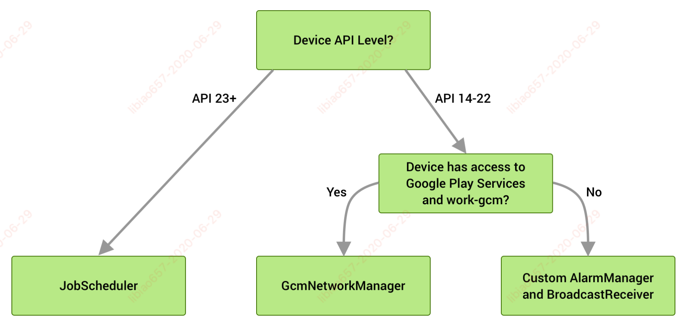
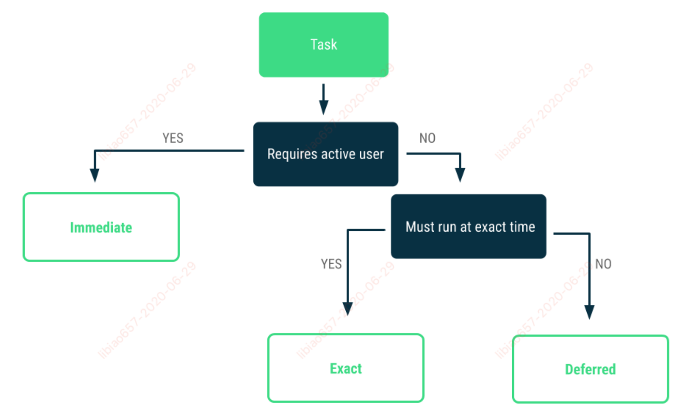
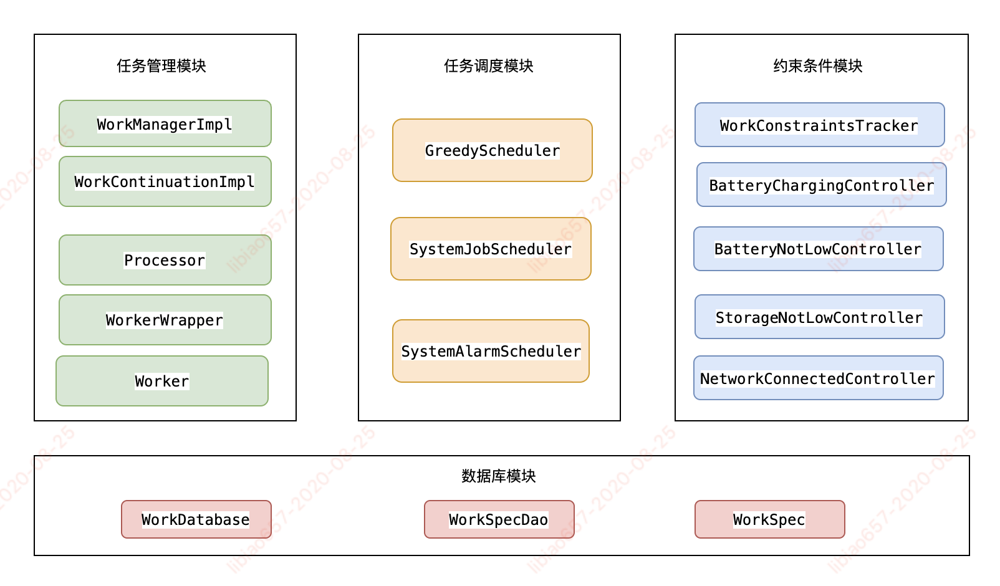

## 背景

每个Android应用都会有一个主线程，用于处理界面渲染和响应用户交互。对于一些比较耗时的任务（比如图片编解码，访问磁盘或网络请求等等），为了不让主线程变慢影响到用户体验，都应该放到后台线程去处理。Android系统也为后台任务提供了很多解决方案，比如Thread，AsyncTask，IntentService，JobScheduler，FirebaseJobDispatcher, GcmNetworkManager等，但如果这些API使用不当的话，可能会消耗大量的电量。Android系统为了最大程度的节省电量和规范App后台行为也是做了很多尝试：

* Android 6.0（API 级别 23）引入了低电耗模式和应用待机模式。低电耗模式会在屏幕处于关闭状态且设备处于静止状态时限制应用行为。应用待机模式会将未使用的应用置于一种特殊状态，进入这种状态后，应用的网络访问、作业和同步会受到限制。

* Android 7.0（API 级别 24）限制了隐式广播，并引入了随时随地使用低电耗模式。

* Android 8.0（API 级别 26）进一步限制了后台行为，例如限制后台应用接受位置更新的频率和解除App所具有的所有唤醒锁。

* Android 9（API 级别 28）引入了应用待机存储分区，通过它，系统会根据应用使用模式动态确定应用资源请求的优先级。

* 推出 WorkManager API，为应用程序中那些不需要及时完成的后台任务，提供统一的解决方案。原先的FirebaseJobDispatcher、GcmNetworkManager将会慢慢的被弃用不再支持。


## WorkManager的特性

WorkManager是一个处理可延迟的异步任务的组件，除了提供更简单和一致的API之外，还有很多其它的优点：

* 兼容范围广

WorkManager最低能兼容API Level 14，并且能依据设备的情况，选择不同的执行方案。在API Level 23+，通过JobScheduler来调度任务，而在API Level 23以下的设备中，通过AlarmManager和Broadcast Receivers组合调度任务。但无论采用哪种方案，任务最终都是交由Executor来完成。 


* Work Constraints

可定义任务执行的最佳条件，比如可以定义只在WiFi连接的情况下处理任务。

* Robust Scheduling

支持一次性任务和周期性任务；支持对任务做监控和管理；遵循低电耗模式等省电功能；确保任务执行，即使应用退出或设备重启也可同样执行任务；等等

* Flexible Retry Policy

对于失败的任务，可配置灵活的重试策略。

* Work Chaining

对于复杂的任务，支持将多个任务链接在一起，允许控制一部分任务串行，一部分任务并行。对于每一个任务，都可以定义输入和输出的数据，当任务链接在一起执行时，上一个任务的输出数据自动作为下一个任务的输入数据。

* Built-In Treading Interoperability

支持使用RxJava和Coroutines来处理异步任务。

## WorkManager的使用场景

#### Android官方将后台任务分为3种类型

* Immediate

* Deferred

* Exact




#### 每种后台任务类型官方推荐的解决方案

* Immediate tasks

对于那些当用户离开某个范围或完成交互时应该结束的任务，建议使用Kotlin协程。

对于Java程序，可以使用线程池。

对于媒体播放、导航等特殊场景，推荐使用前台服务。

* Deferred tasks

对于不需要立刻响应用户的交互，可在将来任何时间运行的任务，推荐使用WorkManager，

WorkManager使调度可延迟的异步任务变得很容易，即使App退出或设备重新启动，这些任务也会运行。

* Exact tasks

在特定时间点需要执行的任务，推荐使用AlarmManager。

#### 总结WorkManager的使用场景

适用于不紧急、可推迟的任务，并且保证任务一定会被执行。比如发送App日志，同步App数据，备份用户数据等。

> WorkManager为什么能够保证任务一定会被执行？
> 
这是因为WorkManager有自己的数据库，关于任务的所有信息和数据都会保存在这个数据库中，
因此，只要你的任务交给了WorkManager，哪怕你的App彻底退出，或者设备重新启动，WorkManager依然能够还原
任务场景去执行。


## WorkManager的基本使用

1、在app的build.gradle中添加依赖

```
dependencies {
      def work_version = "2.3.4"

        // (Java only)
        implementation "androidx.work:work-runtime:$work_version"

        // Kotlin + coroutines
        implementation "androidx.work:work-runtime-ktx:$work_version"

        // optional - RxJava2 support
        implementation "androidx.work:work-rxjava2:$work_version"
      }
```

2、创建后台任务

任务是使用 Worker 类定义的。继承Worker类，覆盖doWork()方法，所有需要在任务中执行的代码都在该方法中编写。

例如，要创建上传图像的 Worker，您可以执行以下操作：

```
class UploadWorker(context: Context, params: WorkerParameters) : Worker(context, params) {

    override fun doWork(): Result {
        Log.i("libiao", "doWork: ${Thread.currentThread().name}")
        return Result.success()
    }

}
```

doWork()方法有三种类型的返回值：

* 执行成功返回Result.success() / Result.success(@NonNull Data outputData)
* 执行失败返回Result.failure() / Result.failure(@NonNull Data outputData)
* 需要重新执行返回Result.retry()

3、配置运行任务的方式和时间

Worker 定义工作单元，WorkRequest 则定义工作的运行方式和时间。

任务可以是一次性的，也可以是周期性的。对于一次性 WorkRequest，请使用 OneTimeWorkRequest，

对于周期性工作，请使用 PeriodicWorkRequest。

为 UploadWorker 构建 WorkRequest 最简单的示例为：

```
val uploadWorkRequest = OneTimeWorkRequestBuilder<UploadWorker>().build()
```

WorkRequest 中还可以包含其他信息，例如任务在运行时应遵循的约束、工作输入、延迟，以及重试的策略。关于这些选项，下文会有更详细的描述。

4、将任务提交给系统

定义 WorkRequest 之后，您现在可以通过 WorkManager 使用 enqueue() 方法来调度它。

```
WorkManager.getInstance(mContext).enqueue(uploadWorkRequest)

输出：

I/libiao: doWork: pool-1-thread-1

```

## WorkManager详解

### 1、工作约束

可以向工作添加 Constraints，以指明工作在何种条件下可以运行。

可以为任务添加以下约束：

* setRequiresBatteryNotLow(boolean requiresBatteryNotLow) 执行任务时手机电量不能偏低
* setRequiresStorageNotLow(boolean requiresStorageNotLow) 手机储存空间足够时才能执行
* setRequiresCharging(boolean requiresCharging) 充电时才能执行任务
* setRequiresDeviceIdle(boolean requiresDeviceIdle) 空闲时才能执行
* addContentUriTrigger(@NonNull Uri uri, boolean triggerForDescendants) 对某个ContentUri的内容变化进行监听
* setRequiredNetworkType(@NonNull NetworkType networkType) 设置网络相关的约束条件, 取值如下

  | 枚举 | 状态 |
| ----- | ---- |
| NOT_REQUIRED | 对网络没有要求 |
| CONNECTED | 网络连接 |
| UNMETERED | 不计费的网络比如WIFI下执行 |
| NOT_ROAMING | 非漫游网络状态 |
| METERED | 计费网络比如3G，4G下执行 |

构建约束

```
val constraints = Constraints.Builder()
            .setRequiresDeviceIdle(true)
            .setRequiresCharging(true)
            .build()

```

添加约束

```
val uploadWorkRequest = OneTimeWorkRequestBuilder<UploadWorker>()
            .setConstraints(constraints)
            .build()

```

如果指定了多个约束，任务将仅在满足所有约束条件下才会运行。

如果在任务运行期间某个约束不再得到满足，则 WorkManager 将停止工作器。当约束继续得到满足时，系统将重新尝试执行该任务。

### 2、初始延迟

如果工作没有约束，或者工作加入队列时所有约束均已得到满足，则系统可能会选择立即运行任务。如果不希望任务立即运行，则可以将工作指定为在经过一段最短初始延迟时间后再启动。

```
val uploadWorkRequest = OneTimeWorkRequestBuilder<UploadWorker>()
            .setInitialDelay(10, TimeUnit.MINUTES)
            .build()

```
> 注意：执行工作器的确切时间还取决于 WorkRequest 中使用的约束和系统优化方式。WorkManager 经过设计，能够在满足这些约束的情况下提供可能的最佳行为。

### 3、重试策略

如果需要让 WorkManager 重新尝试执行任务，可以从工作器返回 Result.retry()。

然后，系统会根据默认的重试策略重新调度工作。也可以主动设置重试策略。

```
/**
* backoffPolicy：等待时间增长策略
* backoffDelay：第一次重试工作前的最短等待时间
* timeUnit：时间单位
*/
setBackoffCriteria(
                @NonNull BackoffPolicy backoffPolicy,
                long backoffDelay,
                @NonNull TimeUnit timeUnit)
```

BackoffPolicy取值：

* EXPONENTIAL 重试等待时间指数增加（默认）
* LINEAR 重试等待时间线性增加

使用：  

```
val uploadWorkRequest = OneTimeWorkRequestBuilder<UploadWorker>()
            .setBackoffCriteria(
                    BackoffPolicy.LINEAR,
                    OneTimeWorkRequest.MIN_BACKOFF_MILLIS,
                    TimeUnit.MILLISECONDS)
            .build()

```

### 4、定义任务的输入输出

每个任务都可能需要传入参数，或输出结果。例如，上传图像的任务，需要以上传的图像的 URI 为输入，并且可能要求用已上传图像的地址作为输出。

输入和输出值以键值对的形式存储在 Data 对象中。例如输入：

```
// workDataOf (part of KTX) converts a list of pairs to a [Data] object.

val imageData = workDataOf("key" to "value")

val uploadWorkRequest = OneTimeWorkRequestBuilder<UploadWorker>()
            .setInputData(imageData)
            .build()

```

Worker 类可通过调用 Worker.getInputData() 访问输入参数。

类似地，Data 类可用于输出返回值。如需返回 Data 对象，请将它添加到 Result.success() 或 Result.failure() 时的 Result 中，如下所示。

```
class UploadWorker(appContext: Context, workerParams: WorkerParameters)
        : Worker(appContext, workerParams) {

        override fun doWork(): Result {

                // Get the input
                val imageUriInput = getInputData().getString("key")
                // TODO: validate inputs.
                // Do the work
                val response = uploadFile(imageUriInput)

                // Create the output of the work
                val outputData = workDataOf(Constants.KEY_IMAGE_URL to response.imageUrl)

                // Return the output
                return Result.success(outputData)

        }
    }

```

> 注意：按照设计，Data 对象应该很小，值可以是字符串、基本类型或数组变体。如果需要将更多数据传入和传出工作器，应该将数据放在其他位置，例如 Room 数据库。Data 对象的大小上限为 10KB。

### 5、标记工作

可以为任意 WorkRequest 对象分配标记字符串，按逻辑对任务进行分组。这样您就可以对使用特定标记的所有任务执行操作。

例如，WorkManager.cancelAllWorkByTag(String) 会取消使用特定标记的所有任务，而 WorkManager.getWorkInfosByTagLiveData(String) 会返回 LiveData 和具有该标记的所有任务的状态列表。

例如：

```
val uploadWorkRequest =
            OneTimeWorkRequestBuilder<UploadWorker>()
        .setConstraints(constraints)
        .addTag("upload")
        .build()

```

### 6、工作状态

在工作的整个生命周期内，它会经历多个不同的 State

* BLOCKED ：尚未完成的前提性工作

* ENQUEUED ：能够在满足 Constraints 和时机条件后立即运行
* RUNNING ：工作器正在执行
* SUCCEEDED ：返回 Result.success() 的工作器会被视为 SUCCEEDED，这是一种终止 State；只有 OneTimeWorkRequest 可以进入这种 State。
* FAILED ：返回 Result.failure() 的工作器会被视为 FAILED，这也是一种终止 State；只有 OneTimeWorkRequest 可以进入这种 State。所有依赖工作也会被标记为 FAILED，并且不会运行。
* CANCELLED ：当明确取消尚未终止的 WorkRequest 时，它会进入 CANCELLED State。所有依赖工作也会被标记为 CANCELLED，并且不会运行。

### 7、观察工作状态

将工作加入队列后，可以通过 WorkManager 检查其状态。相关信息在 WorkInfo 对象中，包括工作的 id、标签、当前 State 和任何输出数据。

通过以下三种方式获取 WorkInfo：

* 对于特定的 WorkRequest，可以通过 WorkRequest id 来获取 WorkInfo 对象，如 WorkManager.getWorkInfoById(UUID) 或 WorkManager.getWorkInfoByIdLiveData(UUID)

* 对于指定的标记，可以通过tag获取，如 WorkManager.getWorkInfosByTag(String) 或 WorkManager.getWorkInfosByTagLiveData(String)

* 对于唯一工作名称，可以通过工作名称获取，如 WorkManager.getWorkInfosForUniqueWork(String) 或 WorkManager.getWorkInfosForUniqueWorkLiveData(String)

利用每个方法的 LiveData 变量，可以通过注册监听器来观察 WorkInfo 的变化。例如：

```
WorkManager.getInstance(mContext).getWorkInfoByIdLiveData(uploadWorkRequest.id).observe(lifecycleOwner, Observer { workInfo ->
		Log.i("libiao", "uploadWorkRequest: $it")
		if (workInfo != null && workInfo.state == WorkInfo.State.SUCCEEDED) {
				displayMessage("Work finished!")
		}
})
        
输出：

I/libiao: uploadWorkRequest: WorkInfo{mId='9fe3363f-8086-4d1a-9944-1dede94ebfed', mState=ENQUEUED, mOutputData=Data {}, mTags=[libiao, com.libiao.libiaodemo.component.workmanager.UploadWorker], mProgress=Data {}}

I/libiao: uploadWorkRequest: WorkInfo{mId='9fe3363f-8086-4d1a-9944-1dede94ebfed', mState=RUNNING, mOutputData=Data {}, mTags=[libiao, com.libiao.libiaodemo.component.workmanager.UploadWorker], mProgress=Data {}}

I/libiao: uploadWorkRequest: WorkInfo{mId='9fe3363f-8086-4d1a-9944-1dede94ebfed', mState=RUNNING, mOutputData=Data {}, mTags=[libiao, com.libiao.libiaodemo.component.workmanager.UploadWorker], mProgress=Data {progress : 0, }}

I/libiao: uploadWorkRequest: WorkInfo{mId='9fe3363f-8086-4d1a-9944-1dede94ebfed', mState=RUNNING, mOutputData=Data {}, mTags=[libiao, com.libiao.libiaodemo.component.workmanager.UploadWorker], mProgress=Data {progress : 50, }}

I/libiao: uploadWorkRequest: WorkInfo{mId='9fe3363f-8086-4d1a-9944-1dede94ebfed', mState=SUCCEEDED, mOutputData=Data {}, mTags=[libiao, com.libiao.libiaodemo.component.workmanager.UploadWorker], mProgress=Data {}}


```

### 8、观察工作的进度

WorkManager 2.3.0-alpha01 为设置和观察工作器的中间进度提供了支持。如果应用在前台运行时，工作器保持运行状态，也可以使用返回 WorkInfo 的 LiveData 的 API 向用户显示此信息。

只有在 ListenableWorker 运行时才能观察到和更新进度信息。如果尝试在 ListenableWorker 完成执行后在其中设置进度，则将会被忽略。

#### 更新进度

对于使用 ListenableWorker 或 Worker 的 Java 开发者，使用 setProgressAsync() API 。更新进度是异步过程，因为更新过程需要将进度信息存储在数据库中。

在 Kotlin 中，可以使用 CoroutineWorker 对象的 setProgress() API 来更新进度信息。

比如下面这个简单的 ProgressWorker。该 Worker 启动时将进度设置为 0，完成时将进度值更新为 100。

```
class ProgressWorker(context: Context, parameters: WorkerParameters) :
        CoroutineWorker(context, parameters) {

        companion object {
            const val Progress = "Progress"
            private const val delayDuration = 1L
        }

        override suspend fun doWork(): Result {
            val firstUpdate = workDataOf(Progress to 0)
            val lastUpdate = workDataOf(Progress to 100)
            setProgress(firstUpdate)
            delay(delayDuration)
            setProgress(lastUpdate)
            return Result.success()
        }
    }

```

#### 观察进度

观察进度信息也很简单。通过getWorkInfoBy…LiveData() 方法获取 WorkInfo，然后注册监听器来观察 WorkInfo 的变化，WorkInfo里有进度相关的信息。

```
WorkManager.getInstance(applicationContext)
        // requestId is the WorkRequest id
        .getWorkInfoByIdLiveData(requestId)
        .observe(observer, Observer { workInfo: WorkInfo? ->
                if (workInfo != null) {
                    val progress = workInfo.progress
                    val value = progress.getInt(Progress, 0)
                    // Do something with progress information
                }
        })

```

### 9、链接工作

可以使用 WorkManager 创建工作链并为其排队。工作链用于指定多个关联任务并定义这些任务的运行顺序。

* 并行

```
WorkManager.getInstance(mContext).beginWith(listOf(filter1, filter2, filter3)).enqueue()
```

* 串行

```
WorkManager.getInstance(mContext).beginWith(listOf(filter1, filter2, filter3))
        .then(request2)
        .then(request3)
        .enqueue()
```

* 组合：比如要求AB串行，CD串行，但两个串之间要并发，并且最后要把两个串的结果汇总到E。

```
val chuan1 = WorkManager.getInstance(mContext)
    .beginWith(A)
    .then(B)
val chuan2 = WorkManager.getInstance(mContext)
    .beginWith(C)
    .then(D)
WorkContinuation
    .combine(listOf(chuan1, chuan2))
    .then(E)
    .enqueue()
```

在使用 OneTimeWorkRequest 链时，父级 OneTimeWorkRequest 的输出将作为输入传递给子级。因此在上面的 串行 示例中，filter1、filter2 和 filter3 的输出将作为输入传递给 request2 请求。

为了管理来自多个父级 OneTimeWorkRequest 的输入，WorkManager 使用 InputMerger。

WorkManager 提供两种不同类型的 InputMerger：

* OverwritingInputMerger 会尝试将所有输入中的所有键添加到输出中。如果发生冲突，它会覆盖先前设置的键。

* ArrayCreatingInputMerger 会尝试合并输入，并在必要时创建数组。

```
val compressWorker = OneTimeWorkRequestBuilder<CompressWorker>()
                .setInputMerger(ArrayCreatingInputMerger::class)
                .build()
```

注意：

> 1、从属 OneTimeWorkRequest 仅在其所有父级 OneTimeWorkRequest 都成功完成（即返回 Result.success()）时才会解除阻塞（变为 ENQUEUED 状态）。

> 2、如果有任何父级 OneTimeWorkRequest 失败（返回 Result.failure()），则所有从属 OneTimeWorkRequest 也会被标记为 FAILED。

> 3、如果有任何父级 OneTimeWorkRequest 被取消，则所有从属 OneTimeWorkRequest 也会被标记为 CANCELLED。


### 10、取消和停止工作

如果不再需要运行先前加入队列的工作，则可以将其取消。最简单的方法是使用id 调用 WorkManager.cancelWorkById(UUID) 来取消单个 WorkRequest：

```
WorkManager.cancelWorkById(workRequest.id)

```

在后台，WorkManager 会检查工作的 State。如果工作已经完成，则不会发生任何变化。否则，其状态将更改为 CANCELLED，之后就不会运行这个工作。任何依赖于这项工作的 WorkRequests 的状态也将变为 CANCELLED。

此外，如果工作当前的状态为 RUNNING，则工作器也会收到对 ListenableWorker.onStopped() 的调用。如需执行任何清理操作，请覆写此方法。在工作器中可以通过调用 ListenableWorker.isStopped()判断系统是否停止了这个工作。

也可以使用 WorkManager.cancelAllWorkByTag(String) 按标记取消 WorkRequest。请注意，此方法会取消所有具有此标记的工作。此外，还可以使用 WorkManager.cancelUniqueWork(String) 取消具有相应唯一名称的所有工作。


### 11、重复性工作

如果应用需要定期运行某些任务。例如，定期备份数据或者上传日志到服务器。使用PeriodicWorkRequest

PeriodicWorkRequest 无法链接。如果需要链接任务，请考虑 OneTimeWorkRequest。

```
val constraints = Constraints.Builder()
            .setRequiresCharging(true)
            .build()

val saveRequest = PeriodicWorkRequestBuilder<SaveImageToFileWorker>(1, TimeUnit.HOURS)
        .setConstraints(constraints)
        .build()

WorkManager.getInstance(mContext).enqueue(saveRequest)

```

示例中展示了一个重复间隔为一小时的定期工作请求。

重复间隔定义为重复之间的最短时间。工作器的确切执行时间取决于您在工作请求中使用的约束，也取决于系统进行的优化。

在示例中，PeriodicWorkRequest 还要求设备接通电源。在这种情况下，即使过了定义的一小时重复间隔，PeriodicWorkRequest 也将在设备接通电源时运行。

可以像 OneTimeWorkRequest 一样观察 PeriodicWorkRequest 的状态。

> 可以定义的最短重复间隔是 15 分钟（与 JobScheduler API 相同）。

### 12、唯一工作

唯一工作是一个概念性非常强的术语，可确保一次只有一个具有特定名称的工作链。与 id 不同的是，唯一名称是可写的，由开发者指定，而不是由 WorkManager 自动生成。与标记不同，唯一名称仅与“一个”工作链关联。

```
/**
* uniqueWorkName：唯一名称 - 这是我们用来标识 WorkRequest 的键
* existingWorkPolicy：冲突解决策略，它指定了如果已经存在一个具有该唯一名称的未完成工作链，WorkManager 应该如何处理
* work：工作
*/
public Operation enqueueUniqueWork(
            @NonNull String uniqueWorkName,
            @NonNull ExistingWorkPolicy existingWorkPolicy,
            @NonNull OneTimeWorkRequest work)

```

ExistingWorkPolicy取值：

* REPLACE 取消现有工作链，并将其替换为新工作链。

* KEEP 保持现有序列并忽略新请求
* APPEND 在现有序列的最后一个任务完成后运行新序列的第一个任务。不能将 APPEND 与 PeriodicWorkRequest 一起使用。

当有不能够多次排队的任务时，唯一工作将非常有用。例如，如果您的应用需要将其数据同步到网络，您可能需要对一个名为“sync”的序列进行排队，并指定当已经存在具有该名称的序列时，应该忽略新的任务。

如果需要创建一个唯一工作链，可以使用 WorkManager.beginUniqueWork(String, ExistingWorkPolicy, OneTimeWorkRequest) 代替 beginWith()。

### 13、自定义 WorkManager 配置和初始化（2.1.0及更高版本）

默认情况下，当应用启动时，WorkManager 根据 适合大多数应用的合理选项 自动进行配置。如果需要进一步控制 WorkManager 管理和调度工作的方式，可以通过自己初始化 WorkManager 自定义 WorkManager 的配置。

自定义WorkManager配置，可以做到让其按需初始化，通过按需初始化，可以仅在需要 WorkManager 时创建该组件，而不必每次应用启动时都创建。这样做可将 WorkManager 从关键启动路径中移出，从而提高应用启动性能。要使用按需初始化，请执行以下操作：

#### 移除默认初始化程序

如需提供自己的配置，必须先移除默认初始化程序。为此，请使用合并规则 tools:node="remove" 更新 AndroidManifest.xml：

```
<provider
        android:name="androidx.work.impl.WorkManagerInitializer"
        android:authorities="${applicationId}.workmanager-init"
        tools:node="remove" />

```

#### 实现 Configuration.Provider

让应用的 Application 类实现 Configuration.Provider 接口，并提供自己的 Configuration.Provider.getWorkManagerConfiguration() 实现。

当需要使用 WorkManager 时，请确保调用方法 WorkManager.getInstance(Context)。WorkManager 会调用应用的自定义 getWorkManagerConfiguration() 方法来发现其 Configuration。（无需自己调用 WorkManager.initialize()。）

```
class MyApplication() : Application(), Configuration.Provider {
         override fun getWorkManagerConfiguration() =
               Configuration.Builder()
                    .setMinimumLoggingLevel(android.util.Log.INFO)
                    .build()
}

```

### 14、WorkManager 中的线程处理

WorkManager 提供了四种不同类型的工作基元：

* Worker 是最简单的实现，前面已经有所介绍。WorkManager 会在后台线程上自动运行它；

* CoroutineWorker 建议 Kotlin 用户实现这个，CoroutineWorker使用协程处理后台任务，默认使用Dispatcher，也可以自定义；
* RxWorker 适合RxJava2用户；
* ListenableWorker 是 Worker、CoroutineWorker 和 RxWorker 的基类。该类专为需要与基于回调的异步API进行交互并且不使用 RxJava2 的 Java 开发者而设计。

#### Worker

当使用 Worker 时，WorkManager 会自动在后台线程中调用 Worker.doWork()。该后台线程来自于 WorkManager 的 Configuration 中指定的 Executor。

默认情况下，WorkManager 会有默认的 Executor，但可以自定义。例如，可以共享应用现有的后台 Executor，也可以创建单线程 Executor 以确保所有后台工作都按顺序执行，或者指定一个具有不同线程数的 ThreadPool。

要自定义 Executor，需要自定义WorkManager配置。在配置 WorkManager 时，可以按以下方式指定 Executor：

```
override fun getWorkManagerConfiguration() =
       Configuration.Builder()
             .setExecutor(Executors.newFixedThreadPool(8))
             .build()
```

请注意，Worker.doWork() 是同步调用 - 将会以阻塞方式完成整个后台工作，并在方法退出时完成工作。如果在 doWork() 中调用异步 API 并返回 Result，则回调可能无法正常运行。如果遇到这种情况，请考虑使用 ListenableWorker

当前正在运行的 Worker 因为任何原因而停止时，它会收到对 Worker.onStopped() 的调用。覆写此方法或在代码的检查点处调用 Worker.isStopped()，并在必要时释放资源。

```
class DownloadWorker(context: Context, params: WorkerParameters) : Worker(context, params) {

        override fun doWork(): ListenableWorker.Result {
            for (i in 0..99) {
                if (isStopped) {
                    break
                }

                try {
                    downloadSynchronously("https://www.google.com")
                } catch (e: IOException) {
                    return ListenableWorker.Result.failure()
                }

            }

            return ListenableWorker.Result.success()
        }
    }

```

Worker 停止后，从 Worker.doWork() 返回什么已不重要；Result 将被忽略。

#### CoroutineWorker

对于 Kotlin 用户，WorkManager 为协程提供了支持。

不要扩展 Worker，而应扩展 CoroutineWorker，后者使用的 API 略有不同。

例如，如果要构建简单的 CoroutineWorker 来执行某些网络操作，则需要执行以下操作：

```
class CoroutineDownloadWorker(context: Context, params: WorkerParameters) : CoroutineWorker(context, params) {

        override suspend fun doWork(): Result = coroutineScope {
            val jobs = (0 until 100).map {
                async {
                    downloadSynchronously("https://www.google.com")
                }
            }

            // awaitAll will throw an exception if a download fails, which CoroutineWorker will treat as a failure
            jobs.awaitAll()
            Result.success()
        }
    }

```

请注意，CoroutineWorker.doWork() 是一个“挂起”函数。不同于 Worker，此代码不会在 Configuration 中指定的 Executor 上运行，而是默认为 Dispatchers.Default。可以提供自己的 CoroutineContext 来自定义这个行为。

在上面的示例中，如果希望在 Dispatchers.IO 上完成此操作，如下所示：

```
class CoroutineDownloadWorker(context: Context, params: WorkerParameters) : CoroutineWorker(context, params) {

        override val coroutineContext = Dispatchers.IO

        override suspend fun doWork(): Result = coroutineScope {
            val jobs = (0 until 100).map {
                async {
                    downloadSynchronously("https://www.google.com")
                }
            }

            // awaitAll will throw an exception if a download fails, which CoroutineWorker will treat as a failure
            jobs.awaitAll()
            Result.success()
        }
    }
    
```

CoroutineWorker 通过取消协程并传播取消信号来自动处理停止工做情况，无需做其它任何处理。

#### RxWorker

扩展 RxWorker，而不是扩展 Worker。

#### ListenableWorker

在某些情况下，如果需要在任务中处理基于回调的异步操作，这时不能只依靠 Worker 来完成操作，因为它只能以阻塞方式完成这项任务。WorkManager 通过 ListenableWorker 支持该用例。

ListenableWorker 是最低层级的工作器 API；Worker、CoroutineWorker 和 RxWorker 都是从这个类衍生而来的。

ListenableWorker 只会发出信号以表明应该开始或停止工作，而线程处理则完全交由您负责完成。开始工作信号在主线程上调用，因此请务必手动转到您选择的后台线程。

ListenableWorker.startWork() 会返回一个使用 Result 设置的 ListenableFuture。ListenableFuture 是一个轻量级接口：它是一个 Future，用于提供监听器和传播异常的功能。完成操作后，需要使用 Result 设置返回结果。

创建 ListenableFuture需要导入councurrent-futures 包

```
implementation "androidx.concurrent:concurrent-futures-ktx:1.1.0-alpha01"

```

如果希望基于异步回调执行某些工作，可以执行如下操作：

```
public class CallbackWorker extends ListenableWorker {

        public CallbackWorker(Context context, WorkerParameters params) {
            super(context, params);
        }

        @NonNull
        @Override
        public ListenableFuture<Result> startWork() {
            return CallbackToFutureAdapter.getFuture(completer -> {
                Callback callback = new Callback() {
                    int successes = 0;

                    @Override
                    public void onFailure(Call call, IOException e) {
                        completer.setException(e);
                    }

                    @Override
                    public void onResponse(Call call, Response response) {
                        ++successes;
                        if (successes == 100) {
                            completer.set(Result.success());
                        }
                    }
                };

                for (int i = 0; i < 100; ++i) {
                    downloadAsynchronously("https://www.google.com", callback);
                }
                return callback;
            });
        }
    }

```

如果工作停止会发生什么？如果预计工作会停止，则始终会取消 ListenableWorker 的 ListenableFuture。通过使用 CallbackToFutureAdapter，只需添加一个取消监听器即可，如下所示：

```
public class CallbackWorker extends ListenableWorker {

        public CallbackWorker(Context context, WorkerParameters params) {
            super(context, params);
        }

        @NonNull
        @Override
        public ListenableFuture<Result> startWork() {
            return CallbackToFutureAdapter.getFuture(completer -> {
                Callback callback = new Callback() {
                    int successes = 0;

                    @Override
                    public void onFailure(Call call, IOException e) {
                        completer.setException(e);
                    }

                    @Override
                    public void onResponse(Call call, Response response) {
                        ++successes;
                        if (successes == 100) {
                            completer.set(Result.success());
                        }
                    }
                };

                completer.addCancellationListener(cancelDownloadsRunnable, executor);

                for (int i = 0; i < 100; ++i) {
                    downloadAsynchronously("https://www.google.com", callback);
                }
                return callback;
            });
        }
    }

```

### 15、支持长时间运行的工作器

WorkManager 2.3.0-alpha02 增加了对长时间运行的工作器的支持。在这种情况下，WorkManager 可以向操作系统提供一个信号，指示在此项工作执行期间应尽可能让进程保持活跃状态。这些工作器可以运行超过 10 分钟。这一新功能的场景包括批量上传或下载（不可分块）、在本地进行的机器学习模型处理，或者对用户很重要的任务。

在底层，WorkManager 会管理和运行前台服务以执行 WorkRequest，同时还会显示可配置的通知。

ListenableWorker 支持 setForegroundAsync() API，而 CoroutineWorker 则支持 setForeground() API。这些 API 允许开发者指定此 WorkRequest 是重要的（从用户的角度来看）或者是长时间运行的工作器。

从 2.3.0-alpha03 开始，WorkManager 还允许您创建可用来取消工作器的 PendingIntent，而无需使用 createCancelPendingIntent() API 注册新的 Android 组件。此方法与 setForegroundAsync() 或 setForeground() API 一起使用时特别有用，可用于添加取消 Worker 的通知操作。

示例代码参考：

https://developer.android.google.cn/topic/libraries/architecture/workmanager/advanced/long-running

## WorkManager架构图


### 任务管理模块

WorkManagerImpl：任务管理的入口，单例类，里面持有配置对象Configuration，数据库对象WorkDatabase，线程池对象TaskExecutor，调度器对象Scheduler，任务处理器对象Processor等

WorkContinuationImpl：组任务管理器，一个WorkContinuationImpl对象对应一组任务，触发任务的调度

Processor：任务处理器，startWork的入口，构建任务包装对象WorkerWrapper

WorkerWrapper：任务包装器，根据任务状态判断任务是否需要执行

Work：任务执行体

### 任务调度模块

GreedyScheduler：贪婪的调度器，每个任务都会配置这个调度器，尝试立即执行任务

SystemJobScheduler：封装的是JobScheduler，在Android6.0以上的任务会配置这个调度器

SystemAlarmScheduler：封装的是AlarmManager+Broadcast的调度方式，在Android6.0以下的任务会配置这个调度器

### 任务约束模块

WorkConstraintsTracker：任务约束检测

BatteryChargingController：判断手机是否在充电状态

BatteryNotLowController：判断手机电量

StorageNotLowController：判断手机存储

NetworkConnectedController：判断网络连接状态

### 数据库模块

WorkDatabase：Room数据库

WorkSpecDao：任务数据库接口

WorkSpec：任务数据结构


