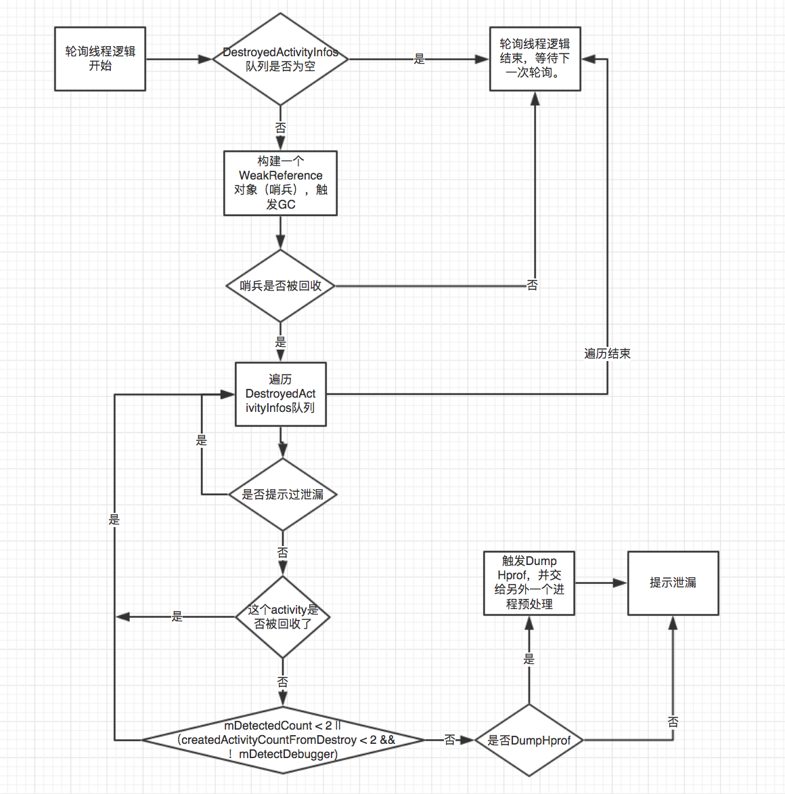
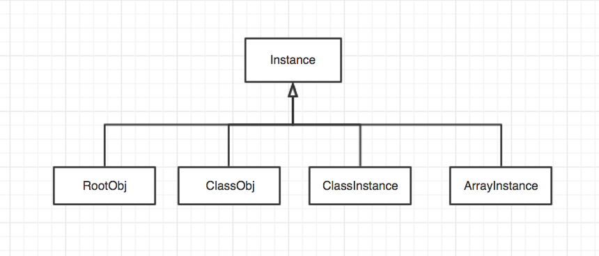

#ResourceCanary

Activity泄漏和Bitmap对象冗余检测工具。

##接入

```
ResourcePlugin resourcePlugin = new ResourcePlugin(new ResourceConfig.Builder()
                .dynamicConfig(dynamicConfig)
                .setDumpHprof(true)
                .setDetectDebuger(true)     //only set true when in sample, not in your app
                .build());
builder.plugin(resourcePlugin);
ResourcePlugin.activityLeakFixer(context);
Matrix.init(builder.build());
resourcePlugin.start();

```

##特点


* 分离了检测和分析部分，便于在不打断自动化测试的前提下持续输出分析后的检测结果

* 对检测部分生成的 Hprof 文件进行了裁剪，移除了大部分无用数据，降低了传输 Hprof 文件的开销

* 增加了重复 Bitmap 对象检测，方便通过减少冗余 Bitmap 数量，降低内存消耗


###特点一:分离了检测和分析部分

检测部分放在app侧，分析部分放在服务端。

####1、检测部分：Activity泄漏的检测原理

什么是Activity泄漏？

> Activity对象被生命周期更长的对象通过强引用持有，使Activity生命周期结束后仍无法被GC机制回收，导致其占用的内存空间无法得到释放。


不难发现要监测Activity泄漏，我们要解决两个问题：

* 如何在一个恰当的时机得知一个Activity已经结束了生命周期
* 如何判断一个Activity无法被GC机制回收

对于第一个问题，熟悉Activity生命周期的都知道，Activity.onDestroy()方法代表这个Activity结束了生命周期，可以被回收了。所以我们可以通过Application.registerActivityLifecycleCallbacks()方法注册一个回调对象，在回调对象的onActivityDestroyed()方法中记录。

对于第二个问题，通过创建一个持有已销毁的Activity的WeakReference，然后主动触发一次GC，如果这个Activity能被回收，则持有它的WeakReference会被置空，且这个被回收的Activity一段时间后会被加入事先注册到WeakReference的一个队列里。这样我们就能间接知道某个被销毁的Activity能否被回收了。


###检测工作流程

####主线程逻辑：收集被销毁的Activity信息

源码中有两处Application.registerActivityLifecycleCallbacks()方法注册回调。

第一处，由接入方在工具初始化阶段主动调用。主要解决InputMethodManager泄漏的bug。InputMethodManager中的这3个成员变量"mCurRootView", "mServedView", "mNextServedView"会间接持有activity的引用。还有华为手机独有的mLastSrvView成员变量。

```
public static void activityLeakFixer(Application application) {
        // Auto break the path from Views in their holder to gc root when activity is destroyed.
        application.registerActivityLifecycleCallbacks(new ActivityLifeCycleCallbacksAdapter() {
            @Override
            public void onActivityDestroyed(Activity activity) {
                ActivityLeakFixer.fixInputMethodManagerLeak(activity);
                ActivityLeakFixer.unbindDrawables(activity);
            }
        });
    }

```

第二处，启动检测流程后注册。

```
private final Application.ActivityLifecycleCallbacks mRemovedActivityMonitor = new ActivityLifeCycleCallbacksAdapter() {
        @Override
        public void onActivityCreated(Activity activity, Bundle savedInstanceState) {
            mCurrentCreatedActivityCount.incrementAndGet();
        }

        @Override
        public void onActivityDestroyed(Activity activity) {
            pushDestroyedActivityInfo(activity);
        }
    };
```

在 onActivityDestroyed 方法里记录Activity信息，构建成DestroyedActivityInfo对象，添加到队列里。

DestroyedActivityInfo 数据结构如下：

```
public final String mKey;
public final String mActivityName;
public final WeakReference<Activity> mActivityRef;
public final long mLastCreatedActivityCount; // 被检查出泄漏时Activity创建个数
public int mDetectedCount = 0;//被检查出泄漏次数

```

####轮询线程逻辑:




###对比LeakCanary，ResourceCanary做的优化

| LeakCanary | ResourceCanary |
| ------ | ------ |
| 对Activity是否泄漏的判断依赖VM会将可回收的对象加入WeakReference关联的ReferenceQueue这一特性，而将可回收对象加入ReferenceQueue需要等待一段时间，LeakCanary采用延时100ms的做法加以规避，但似乎并不绝对管用 | 直接通过WeakReference.get()来判断对象是否已被回收，避免因延迟导致误判 | 
| VM并没有提供强制触发GC的API，通过System.gc()或Runtime.getRuntime().gc()只能“建议”系统进行GC，如果系统忽略了我们的GC请求，可回收的对象就不会被加入ReferenceQueue | 增加一个一定能被回收的“哨兵”对象，用来确认系统确实进行了GC | 
| 监测逻辑是异步的，如果判断Activity是否可回收时某个Activity正好还被某个方法的局部变量持有，就会引起误判 | 若发现某个Activity无法被回收，再重复判断2次，且要求从该Activity被记录起有2个以上的Activity被创建才认为是泄漏，以防在判断时该Activity被局部变量持有导致误判 | 
| 若反复进入泄漏的Activity，LeakCanary会重复提示该Activity已泄漏 | 对已判断为泄漏的Activity，记录其类名，避免重复提示该Activity已泄漏 |


###分析部分：对Hprof文件的分析

####获取泄漏的Activity到GC Root的强引用链

Hprof文件中包含了Dump时刻内存中的所有对象的信息，包括类的描述，实例的数据和引用关系，线程的栈信息等。具体可参考这份文档中的[Binary Dump Format](http://hg.openjdk.java.net/jdk8/jdk8/jdk/raw-file/43cb25339b55/src/share/demo/jvmti/hprof/manual.html)一节。按照文档描述的格式将Hprof中的实例信息解析成描述引用关系的图结构后，套用经典的图搜索算法即可找到泄漏的Activity到GC Root的强引用链了。

大多数时候这样的强引用链不止一条，全部找出来会让一次分析操作的耗时大大增加，延长了整个测试流程的周期，而且对解决问题并没有更多帮助。实际上我们只需要找到最短的那条就可以了。

如果持有泄漏的Activity的GC Root不止一个，或者从GC Root出发的引用不止一条，在Matrix框架成为流程化工具的背景下我们可以通过多次检测来解决。

####什么是 GC Root

GC Root 是指这样一类对象，他们本身并不被其他生命周期更长的对象持有，但JVM的特性导致了这些对象无法被GC机制回收，因此从他们出发，经过一系列强引用可到达的对象都是无法被回收的。他们包括下列对象：

* 类；（被JVM加载的类是无法卸载的，因此无法被回收，导致被类持有（即通过静态成员持有）的对象也无法被回收）；
* 活动的Thread实例；
* 局部变量或方法参数变量持有的对象；
* JNILocalReference持有的对象；
* JNIGlobalReference持有的对象；
* synchronized关键字用到的对象；

如果某个Activity被泄漏，则必然存在从它到某个GC Root的强引用链。只要我们将这条强引用链找出来，开发者就能根据引用链上的对象找到合适的修改点快速解决问题。


#### haha库

LeakCanary的代码里有一个叫haha的库已经把Hprof文件按照文档描述的格式解析成了结构化的引用关系图，而且LeakCanary也按照与上面的描述类似的思路实现了引用链的提取逻辑，所以ResourceCanary复用了这部分代码。

解析后内存堆中的所有数据分为如下四种类型：




#### 怎么寻找泄漏的activity到GC Root的强引用链

1、找到泄漏的activity在内存堆中的实例对象Instance

2、遍历所有GC Root，每个GC Root对应一个Instance

3、遍历Instance下的所有Field（type == OBJECT），Field也是Instance对象

4、找个某个Field == 泄漏的activity在内存堆中的实例对象Instance

5，结束（图搜索算法）


###特点二：Hprof文件裁剪

Hprof文件的大小一般约为Dump时的内存占用大小，就微信而言Dump出来的Hprof大小通常为150MB～200MB之间，如果不做任何处理直接将此Hprof文件上传到服务端，一方面会消耗大量带宽资源，另一方面服务端将Hprof文件长期存档时也会占用服务器的存储空间。

通过分析Hprof文件格式可知，Hprof文件中buffer区存放了所有对象的数据，包括字符串数据、所有的数组等，而我们的分析过程却只需要用到部分字符串数据和Bitmap的buffer数组，其余的buffer数据都可以直接剔除，这样处理之后的Hprof文件通常能比原始文件小1/10以上。


###特点三：增加了重复 Bitmap 对象检测

把所有未被回收的Bitmap的数据buffer取出来，然后先对比所有长度为1的buffer，找出相同的，记录所属的Bitmap对象；再对比所有长度为2的、长度为3的buffer……直到把所有buffer都比对完，这样就记录下了所有冗余的Bitmap对象了，接着再套用LeakCanary获取引用链的逻辑把这些Bitmap对象到GC Root的最短强引用链找出来即可。

只支持sdkVersion < 26，因为Google官方原文说道 android 3.0 到7.1 bitmap是放在dalvik heap中， 8.0 以后放在native heap中。


##输出格式

###Activity 泄漏

```
"activityLeakResult":{

"failure":"null",

"referenceChain":

[

"android.widget.Toast$TN mWM",

"android.view.WindowManagerImpl mContext",

"android.app.ContextImpl mAutofillClient",

""

],

"leakFound":true,

"className":"",

"analysisDurationMs":591,

"excludedLeak":false

},


```

###Bitmap冗余

```
"duplicatedBitmapResult":
{
"duplicatedBitmapEntries":[
{
"referenceChains":[
],
"bufferHash":"aa89d4656987b461821a95e038d43da7",
"width":90,
"height":90,
"bufferSize":16200
},
"mFailure":"null",
"targetFound":true,
"analyzeDurationMs":6688
}

```


####补充
栈帧 STACK FRAME：
> jvm为每个新创建的线程都分配一个堆栈。堆栈以帧为单位保存线程的状态。jvm对堆栈只进行两种操作：以帧为单位的压栈和出栈操作。

> 栈帧(Stack Frame)是用于支持虚拟机进行方法调用和方法执行的数据结构，它是虚拟机运行时数据区的虚拟机栈(Virtual Machine Stack)的栈元素。栈帧存储了方法的局部变量表，操作数栈，动态连接和方法返回地址等信息。第一个方法从调用开始到执行完成，就对应着一个栈帧在虚拟机栈中从入栈到出栈的过程。


