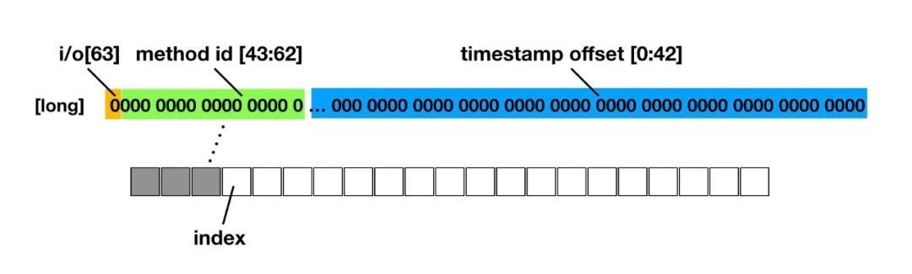

#Matrix
Matrix 是一款微信研发并日常使用的 APM（Application Performance Manage），当前主要运行在 Android 平台上。 Matrix 的目标是建立统一的应用性能接入框架，通过各种性能监控方案，对性能监控项的异常数据进行采集和分析，输出相应的问题分析、定位与优化建议，从而帮助开发者开发出更高质量的应用。

Matrix 当前监控范围包括：应用安装包大小，帧率变化，启动耗时，卡顿，慢方法，SQLite 操作优化，文件读写，内存泄漏等等。

* APK Checker: 针对 APK 安装包的分析检测工具，根据一系列设定好的规则，检测 APK 是否存在特定的问题，并输出较为详细的检测结果报告，用于分析排查问题以及版本追踪。
- Resource Canary: 基于 WeakReference 的特性和 Square Haha 库开发的 Activity 泄漏和 Bitmap 重复创建检测工具
- Trace Canary: 监控界面流畅性、启动耗时、页面切换耗时、慢函数及卡顿等问题
- SQLite Lint: 按官方最佳实践自动化检测 SQLite 语句的使用质量
- IO Canary: 检测文件 IO 问题，包括：文件 IO 监控和 Closeable Leak 监控

##特性
与常规的 APM 工具相比，Matrix 拥有以下特点：

APK Checker

* 具有更好的可用性：JAR 包方式提供，更方便应用到持续集成系统中，从而追踪和对比每个 APK 版本之间的变化

* 更多的检查分析功能：除具备 APKAnalyzer 的功能外，还支持统计 APK 中包含的 R 类、检查是否有多个动态库静态链接了 STL 、搜索 APK 中包含的无用资源，以及支持自定义检查规则等

* 输出的检查结果更加详实：支持可视化的 HTML 格式，便于分析处理的 JSON ，自定义输出等等


Resource Canary

* 分离了检测和分析部分，便于在不打断自动化测试的前提下持续输出分析后的检测结果

* 对检测部分生成的 Hprof 文件进行了裁剪，移除了大部分无用数据，降低了传输 Hprof 文件的开销

* 增加了重复 Bitmap 对象检测，方便通过减少冗余 Bitmap 数量，降低内存消耗


Trace Canary

* 编译期动态修改字节码, 高性能记录执行耗时与调用堆栈

* 准确的定位到发生卡顿的函数，提供执行堆栈、执行耗时、执行次数等信息，帮助快速解决卡顿问题

* 自动涵盖卡顿、启动耗时、页面切换、慢函数检测等多个流畅性指标

SQLite Lint

* 接入简单，代码无侵入

* 数据量无关，开发、测试阶段即可发现SQLite性能隐患

* 检测算法基于最佳实践，高标准把控SQLite质量

* 底层是 C++ 实现，支持多平台扩展


IO Canary

* 接入简单，代码无侵入

* 性能、泄漏全面监控，对 IO 质量心中有数

* 兼容到 Android P

##使用方法

1、在你项目根目录下的 gradle.properties 中配置要依赖的 Matrix 版本号，如：

`MATRIX_VERSION=0.4.10`

2、在你项目根目录下的 build.gradle 文件添加 Matrix 依赖，如：

```
dependencies {
      classpath ("com.tencent.matrix:matrix-gradle-plugin:${MATRIX_VERSION}") { changing = true }
}
```

3、接着，在 app/build.gradle 文件中添加 Matrix 各模块的依赖，如：

```
dependencies {
    implementation group: "com.tencent.matrix", name: "matrix-android-lib", version: MATRIX_VERSION, changing: true
    implementation group: "com.tencent.matrix", name: "matrix-android-commons", version: MATRIX_VERSION, changing: true
    implementation group: "com.tencent.matrix", name: "matrix-trace-canary", version: MATRIX_VERSION, changing: true
    implementation group: "com.tencent.matrix", name: "matrix-resource-canary-android", version: MATRIX_VERSION, changing: true
    implementation group: "com.tencent.matrix", name: "matrix-resource-canary-common", version: MATRIX_VERSION, changing: true
    implementation group: "com.tencent.matrix", name: "matrix-io-canary", version: MATRIX_VERSION, changing: true
    implementation group: "com.tencent.matrix", name: "matrix-sqlite-lint-android-sdk", version: MATRIX_VERSION, changing: true
  }

  apply plugin: 'com.tencent.matrix-plugin'
  matrix {
    trace {
        enable = true	//if you don't want to use trace canary, set false
        baseMethodMapFile = "${project.buildDir}/matrix_output/Debug.methodmap"
        blackListFile = "${project.projectDir}/matrixTrace/blackMethodList.txt"
    }
  }
```

4、实现 PluginListener，接收 Matrix 处理后的数据, 如：

```
public class TestPluginListener extends DefaultPluginListener {
    public static final String TAG = "Matrix.TestPluginListener";
    public TestPluginListener(Context context) {
        super(context);
        
    }

    @Override
    public void onReportIssue(Issue issue) {
        super.onReportIssue(issue);
        MatrixLog.e(TAG, issue.toString());
        
        //add your code to process data
    }
}
```

5、实现动态配置接口， 可修改 Matrix 内部参数. 其中参数对应的 key 位于文件 MatrixEnum中， 摘抄部分示例如下：

```
public class DynamicConfigImplDemo implements IDynamicConfig {
    public DynamicConfigImplDemo() {}

    public boolean isFPSEnable() { return true;}
    public boolean isTraceEnable() { return true; }
    public boolean isMatrixEnable() { return true; }
    public boolean isDumpHprof() {  return false;}

    @Override
    public String get(String key, String defStr) {
        //hook to change default values
    }

    @Override
    public int get(String key, int defInt) {
         //hook to change default values
    }

    @Override
    public long get(String key, long defLong) {
        //hook to change default values
    }

    @Override
    public boolean get(String key, boolean defBool) {
        //hook to change default values
    }

    @Override
    public float get(String key, float defFloat) {
        //hook to change default values
    }
}
```

6、选择程序启动的位置对 Matrix 进行初始化，如在 Application 的继承类中， Init 核心逻辑如下：

```
Matrix.Builder builder = new Matrix.Builder(context);
builder.patchListener(new MatrixPluginListener(context));
DynamicConfigImpl dynamicConfig = new DynamicConfigImpl();
boolean fpsEnable = dynamicConfig.isFPSEnable();
boolean traceEnable = dynamicConfig.isTraceEnable();
TraceConfig traceConfig = new TraceConfig.Builder()
                .dynamicConfig(dynamicConfig)
                .enableFPS(fpsEnable)
                .enableMethodTrace(traceEnable)
                .enableStartUp(traceEnable)
                .splashActivity("")
                .build();
TracePlugin tracePlugin = (new TracePlugin(traceConfig));
builder.plugin(tracePlugin);
Matrix.init(builder.build());
tracePlugin.start();
```

#Trace Canary


* 编译期动态修改字节码, 高性能记录执行耗时与调用堆栈

* 准确的定位到发生卡顿的函数，提供执行堆栈、执行耗时、执行次数等信息，帮助快速解决卡顿问题

* 自动涵盖卡顿、启动耗时、页面切换、慢函数检测等多个流畅性指标

##原理

###1、编译期动态修改字节码, 高性能记录执行耗时与调用堆栈

- **插桩原理：**

我们都知道Android打包流程是 .java文件->.class文件->.dex文件，而要修改字节码，是需要拿到.class文件的，那Google官方在Android Gradle的1.5.0 版本以后提供了 Transfrom API, 允许第三方 Plugin 在打包dex文件之前的编译过程中操作 .class 文件。

拿到.class文件了，大家都知道.class文件是字节码格式的，操作起来难度是相当于大的，所以需要一个字节码操作库来减轻难度，那就是ASM了。

ASM 可以直接产生二进制的class 文件，也可以在增强既有类的功能。Java class 被存储在严格格式定义的 .class文件里，这些类文件拥有足够的元数据来解析类中的所有元素：类名称、方法、属性以及 Java 字节码（指令）。

- **插桩过程的关键点：**

1、选择在该编译任务执行时插桩，是因为 proguard 操作是在该任务之前就完成的，意味着插桩时的 class 文件已经被混淆过的。而选择 proguard 之后去插桩，是因为如果提前插桩会造成部分方法不符合内联规则，没法在 proguard 时进行优化，最终导致程序方法数无法减少，从而引发方法数过大问题。

2、为了减少插桩量及性能损耗，通过遍历 class 方法指令集，判断扫描的函数是否只含有 PUT/READ FIELD 等简单的指令，来过滤一些默认或匿名构造函数，以及 get/set 等简单不耗时函数。

3、针对界面启动耗时，因为要统计从 Activity#onCreate 到 Activity#onWindowFocusChange 间的耗时，所以在插桩过程中需要收集应用内所有 Activity 的实现类，并覆盖 onWindowFocusChange 函数进行打点。 

4、为了方便及高效记录函数执行过程，我们为每个插桩的函数分配一个独立 ID，在插桩过程中，记录插桩的函数签名及分配的 ID，在插桩完成后输出一份 mapping，作为数据上报后的解析支持。

- **怎么记录执行耗时和调用堆栈？**

编译期已经对全局的函数进行插桩，在运行期间每个函数的执行前后都会调用 MethodBeat.i/o 的方法，如果是在主线程中执行，在i/o的方法里会构建一个long类型的变量，如下图，

long占64位bit[0:63]，

[63]记录当前执行的是i/还是o，

[43:62]记录mehtod id，

[0:42]记录函数的执行距离 MethodBeat 模块初始化的时间。

最后把这个long型变量记录到一个预先初始化好的数组 long[] 中 index 的位置（预先分配记录数据的 buffer 长度为 100w，内存占用约 7.6M）。

一个方法的执行时间 = 这个方法的o（）记录时间 - 这个方法的i（）记录时间；

调用堆栈 = long数组。



上面提到 在onWindowFocusChange 函数里打点，所以执行Activity#onWindowFocusChange会回调MethodBeat里的at()方法。

```
public static void at(Activity activity, boolean isFocus) {}
```

- **高性能**

考虑到每个方法执行前后都获取系统时间（System.nanoTime）会对性能影响比较大，而实际上，单个函数执行耗时小于 5ms 的情况，对卡顿来说不是主要原因，可以忽略不计，如果是多次调用的情况，则在它的父级方法中可以反映出来，所以为了减少对性能的影响，通过另一条更新时间的线程每 5ms 去更新一个时间变量，而每个方法执行前后只读取该变量来减少性能损耗。

###2、准确的定位到发生卡顿的函数，提供执行堆栈、执行耗时、执行次数等信息

- **准确定位**

利用系统 Choreographer 模块，向该模块注册一个 FrameCallback 监听对象，并在每次 Vsync 事件 doFrame 通知回来时，循环注册该监听对象，间接统计两次 Vsync 事件的时间间隔，判断时间差是否超出阈值（卡顿），如果超出阈值，则获取数组 index 前的所有数据（即两帧之间的所有函数执行信息）进行分析上报。

每一帧 doframe过后重置index。

- **堆栈聚类**

如果将收集的原始数据进行上报，数据量很大而且后台很难聚类有问题的堆栈，所以在上报之前需要对采集的数据进行简单的整合及裁剪，并分析出一个能代表卡顿堆栈的 key，方便后台聚合。

步骤如下：

1、通过遍历采集的 buffer ，相邻 i 与 o 为一次完整函数执行，每个函数构建一个MethodItem对象（数据结构如下），最后得到链表LinkedList<MethodItem>。

```
private static final class MethodItem {
        int methodId; //
        int durTime; //方法耗时
        int depth; //方法嵌套的深度
        int count = 1; //方法执行次数，如递归
}
```

问题：什么场景下只有 i 没有 o ？这种场景怎么记录耗时 ？

2、将链表LinkedList<MethodItem>按depth构建成一棵树，根结点TreeNode（数据结构如下），

```
private static final class TreeNode {
        MethodItem mItem;
        TreeNode mFather;
        LinkedList<TreeNode> mChildNodes = new LinkedList<>();
}
```


3、对树TreeNode进行整合和裁剪

规则如下：

遍历第一轮：

如果一个树节点（一个方法）的耗时 < 总耗时/20，则移除这个树节点；

如果一个树节点的耗时 < 父节点 * 0.1，则移除这个节点的全部子节点；

此时树节点数 > 20, 遍历第二轮：

如果一个树节点（一个方法）的耗时 < 总耗时/20，则移除这个树节点；

如果一个树节点的耗时 < 父节点 * 0.2，则移除这个节点的全部子节点；

此时树节点数 > 20, 遍历第三轮：

如果一个树节点（一个方法）的耗时 < 总耗时/20，则移除这个树节点；

如果一个树节点的耗时 < 父节点 * 0.3，则移除这个节点的全部子节点；

结束。

4、找出主要耗时的那一级函数，作为代表卡顿堆栈的key。

能作为key的条件：

if（depth == 0） duration > totalCost * 0.3

if（depth > 0） duration > 父duration * 0.6

树节点的深度越大，优先级越大。

5、将整合和裁剪好的树构建成链表LinkedList<MethodItem>

6、遍历链表LinkedList<MethodItem>，构建成json上报

###3、自动涵盖卡顿、启动耗时、页面切换、慢函数检测等多个流畅性指标

主要分为3种监测：

* 帧率
* 应用启动
* 慢方法

###帧率FPS

**什么是卡顿**

什么是卡顿，很多人能马上联系到的是帧率 FPS (每秒显示帧数)。那么多低的 FPS 才是卡顿呢？又或者低 FPS 真的就是卡顿吗？（以下 FPS 默认指平均帧率）

其实并非如此，举个例子，游戏玩家通常追求更流畅的游戏画面体验一般要达到 60FPS 以上，但我们平时看到的大部分电影或视频 FPS 其实不高，一般只有 25FPS ~ 30FPS，而实际上我们也没有觉得卡顿。在人眼结构上看，当一组动作在 1 秒内有 12 次变化（即 12FPS），我们会认为这组动作是连贯的；而当大于 60FPS 时，人眼很难区分出来明显的变化，所以 60FPS 也一直作为业界衡量一个界面流畅程度的重要指标。一个稳定在 30FPS 的动画，我们不会认为是卡顿的，但一旦 FPS 很不稳定，人眼往往容易感知到。

**FPS 低并不意味着卡顿发生，而卡顿发生 FPS 一定不高。**FPS 可以衡量一个界面的流畅性，但往往不能很直观的衡量卡顿的发生，这里有另一个指标（掉帧程度）可以更直观地衡量卡顿。

什么是掉帧（跳帧）？按照理想帧率 60FPS 这个指标，计算出平均每一帧的准备时间有 1000ms/60 = 16.6667ms，如果一帧的准备时间超出这个值，则认为发生掉帧，超出的时间越长，掉帧程度越严重。假设每帧准备时间约 32ms，每次只掉一帧，那么 1 秒内实际只刷新 30 帧，即平均帧率只有 30FPS，但这时往往不会觉得是卡顿。反而如果出现某次严重掉帧（>300ms），那么这一次的变化，通常很容易感知到。所以界面的掉帧程度，往往可以更直观的反映出卡顿。

**怎么衡量流畅性**

我们将掉帧数划分出几个区间进行定级，掉帧数小于 3 帧的情况属于最佳，依次类推，见下表：


**监测流程**

类：FPSTracer

Matrix初始化时由FrameBeat注册Choreographer的callback。

每次 Vsync 事件 doFrame 通知回来时，记录这一帧的时间和对应的场景。

应用在前台启动定时器，每10s上报一次数据。

**FPS数据上报格式：**

```
tag[Trace_FPS]; //该上报对应的tag
type[null];//用于区分同一个tag不同类型的上报
key[null];
content[{"machine":"BEST","cpu_app":0.07414651960256133,"mem":5980266496,"mem_free":153364,
"scene":"",
"dropLevel":{"DROPPED_FROZEN":0,"DROPPED_HIGH":0,"DROPPED_MIDDLE":0,"DROPPED_NORMAL":0,"DROPPED_BEST":60}, //掉帧level分布
"dropSum":{"DROPPED_FROZEN":0,"DROPPED_HIGH":0,"DROPPED_MIDDLE":0,"DROPPED_NORMAL":0,"DROPPED_BEST":0}, //各level掉帧总数
"fps":59.04465866088867,
"tag":"Trace_FPS",
"process":"",
"time":1550152664334}

```

问题：金管家接入，没有帧率数据上报？

###应用启动

类：StartUpTracer

假定的场景如下：

|----app----|--between--|--firstAc---|---secondAc----|

**在哪里能准确记录到应用的创建时间？**

MethodBeat类对象构建时间绝对够早。app启动执行第一个方法后就会构建MethodBeat对象。

初始化类之前先初始化static块。在MethodBeat中有如下代码：

```
static {
    Hacker.hackSysHandlerCallback();
}
```
记录app启动时间。替换ActivityThread里handler处理消息的callback

```
public static void hackSysHandlerCallback() {
        try {
            sApplicationCreateBeginTime = System.currentTimeMillis(); //app启动时间
            sApplicationCreateBeginMethodIndex = MethodBeat.getCurIndex();
            Class<?> forName = Class.forName("android.app.ActivityThread");
            Field field = forName.getDeclaredField("sCurrentActivityThread");
            field.setAccessible(true);
            Object activityThreadValue = field.get(forName);
            Field mH = forName.getDeclaredField("mH");
            mH.setAccessible(true);
            Object handler = mH.get(activityThreadValue);
            Class<?> handlerClass = handler.getClass().getSuperclass();
            Field callbackField = handlerClass.getDeclaredField("mCallback");
            callbackField.setAccessible(true);
            Handler.Callback originalCallback = (Handler.Callback) callbackField.get(handler);
            HackCallback callback = new HackCallback(originalCallback);
            callbackField.set(handler, callback);
            MatrixLog.i(TAG, "hook system handler completed. start:%s", sApplicationCreateBeginTime);
        } catch (Exception e) {
            MatrixLog.e(TAG, "hook system handler err! %s", e.getCause().toString());
        }
    }
```
在callback里记录app启动结束时间和app启动类型。

```
 public boolean handleMessage(Message msg) {
        if (msg.what == LAUNCH_ACTIVITY) {
            Hacker.isEnterAnimationComplete = false;
        } else if (msg.what == ENTER_ANIMATION_COMPLETE) {
            Hacker.isEnterAnimationComplete = true;
        }
        if (!isCreated) {
            if (msg.what == LAUNCH_ACTIVITY || msg.what == CREATE_SERVICE || msg.what == RECEIVER) {
                Hacker.sApplicationCreateEndTime = System.currentTimeMillis(); //app启动结束
                Hacker.sApplicationCreateEndMethodIndex = MethodBeat.getCurIndex();
                Hacker.sApplicationCreateScene = msg.what; //app启动类型
                isCreated = true;
            }
        }
        if (null == mOriginalCallback) {
            return false;
        }
        return mOriginalCallback.handleMessage(msg);
    }
```

回到StartUpTracer类：

onActivityCreated：这里只记录第一个activity的启动时间。

```
public void onActivityCreated(Activity activity) {
        super.onActivityCreated(activity);
        if (isFirstActivityCreate && mFirstActivityMap.isEmpty()) {
            String activityName = activity.getComponentName().getClassName();
            mFirstActivityIndex = getMethodBeat().getCurIndex();
            mFirstActivityName = activityName;
            mFirstActivityMap.put(activityName, System.currentTimeMillis()); //记录第一个activity的启动时间
            getMethodBeat().lockBuffer(true);
        }
    }
```

onActivityEntered：启动时间上报在这个方法里，其做了如下几件事情：

1、第一个activity， 过。

2、第二个activity，记录时间作为activity启动结束时间。

3、计算activityCost，appCreateTime，betweenCost，allCost等时间

4、是否热启动：第一个activity启动时间 - app启动结束时间 > 2s

5、应用启动时间是否大于阀值，是则上报堆栈信息。

6、上报应用启动相关信息。


```
public void onActivityEntered(Activity activity, boolean isFocus, int nowIndex, long[] buffer) {
 		.......
        String activityName = activity.getComponentName().getClassName();
        if (!mActivityEnteredMap.containsKey(activityName) || isFocus) {
            mActivityEnteredMap.put(activityName, System.currentTimeMillis());
        }
        if (!isFocus) {
            MatrixLog.i(TAG, "[onActivityEntered] isFocus false,activityName:%s", activityName);
            return;
        }
		......
        getMethodBeat().lockBuffer(false);
        if (mTraceConfig.isHasSplashActivityName() && activityName.equals(mTraceConfig.getSplashActivityName())) {
            MatrixLog.i(TAG, "[onActivityEntered] has splash activity! %s", mTraceConfig.getSplashActivityName());
            return; //闪屏页（第一个activity）
        }

        long activityEndTime = getValueFromMap(mActivityEnteredMap, activityName);
        long firstActivityStart = getValueFromMap(mFirstActivityMap, mFirstActivityName);
                boolean isWarnStartUp = isWarmStartUp(firstActivityStart);
        long activityCost = activityEndTime - firstActivityStart;
        long appCreateTime = Hacker.sApplicationCreateEndTime - Hacker.sApplicationCreateBeginTime;
        long betweenCost = firstActivityStart - Hacker.sApplicationCreateEndTime;
        long allCost = activityEndTime - Hacker.sApplicationCreateBeginTime;

        if (isWarnStartUp) {
            betweenCost = 0;
            allCost = activityCost;
        }
        long splashCost = 0;
        if (mTraceConfig.isHasSplashActivityName()) {
            long tmp = getValueFromMap(mActivityEnteredMap, mTraceConfig.getSplashActivityName());

            splashCost = tmp == 0 ? 0 : getValueFromMap(mActivityEnteredMap, activityName) - tmp;
        }
        
        EvilMethodTracer tracer = getTracer(EvilMethodTracer.class);
        if (null != tracer) {
            long thresholdMs = isWarnStartUp ? mTraceConfig.getWarmStartUpThresholdMs() : mTraceConfig.getStartUpThresholdMs();
            int startIndex = isWarnStartUp ? mFirstActivityIndex : Hacker.sApplicationCreateBeginMethodIndex;
            int curIndex = getMethodBeat().getCurIndex();
            if (allCost > thresholdMs) {
                EvilMethodTracer evilMethodTracer = getTracer(EvilMethodTracer.class);
                if (null != evilMethodTracer) {
                    evilMethodTracer.handleBuffer(EvilMethodTracer.Type.STARTUP, startIndex, curIndex, MethodBeat.getBuffer(), appCreateTime, Constants.SUBTYPE_STARTUP_APPLICATION);
                }
            }

        }

        mHandler.post(new StartUpReportTask(activityName, appCreateTime, activityCost, betweenCost, splashCost, allCost, isWarnStartUp, Hacker.sApplicationCreateScene));

        mFirstActivityMap.clear();
        mActivityEnteredMap.clear();
        isFirstActivityCreate = false;
        mFirstActivityName = null;
        onDestroy();

    }
```

**应用启动数据上报格式：**

```
tag[Trace_StartUp]
type[null];
key[null];
content[{"machine":"BEST","cpu_app":9.637107478393846E-4,"mem":5980266496,"mem_free":547312,
"application_create":1341,
"first_activity_create":2199,
"stage_between_app_and_activity":40,
"splash_activity_duration":1934,
"startup_duration":3580, //总的应用启动时间
"scene":"",
"is_warm_start_up":false,
"application_create_scene":100, //100 （activity拉起的）；114（service拉起的）；113 （receiver拉起的）；-100 （未知，比如contentprovider）

"tag":"Trace_StartUp",
"process":"",
"time":1550157191369}

```

问题：金管家应用启动流程为 PARSSplashActivity--LauncherActivity--HomePageActivity--AppWelcome--HomePageActivity,为什么能够正常的到HomePageActivity的启动时间？

###慢方法

类：EvilMethodTracer

**原理：**

利用系统 Choreographer 模块，向该模块注册一个 FrameCallback 监听对象，并在每次 Vsync 事件 doFrame 通知回来时，循环注册该监听对象，间接统计两次 Vsync 事件的时间间隔，判断时间差是否超出阈值（卡顿），如果超出阈值，则获取数组 index 前的所有数据（即两帧之间的所有函数执行信息）进行分析上报。

**慢方法分为如下5种类型：**

NORMAL, ENTER, ANR, FULL, STARTUP

- Vsync回调监测的是NORMAL类型

```
public void doFrame(long lastFrameNanos, long frameNanos) {
        int index = getMethodBeat().getCurIndex();
        if (hasEntered && frameNanos - lastFrameNanos > mTraceConfig.getEvilThresholdNano()) {
        handleBuffer(Type.NORMAL, 0, index - 1, getMethodBeat().getBuffer(), (frameNanos - lastFrameNanos) / Constants.TIME_MILLIS_TO_NANO);
        }
        getMethodBeat().resetIndex();
        mLazyScheduler.cancel();
        mLazyScheduler.setUp(this, false);
    }
```
- 每5s回调的定时器监测的是ANR类型。

```
public void onTimeExpire() {
        long happenedAnrTime = getMethodBeat().getCurrentDiffTime();
        setIgnoreFrame(true);
        getMethodBeat().lockBuffer(false);
        handleBuffer(Type.ANR, 0, getMethodBeat().getCurIndex() - 1, getMethodBeat().getBuffer(), null, Constants.DEFAULT_ANR, happenedAnrTime, -1);
    }
```

- StartUpTracer类中监测的是STARTUP类型。

```
public void onActivityEntered(Activity activity, boolean isFocus, int nowIndex, long[] buffer) {
	evilMethodTracer.handleBuffer(EvilMethodTracer.Type.STARTUP, startIndex, curIndex, MethodBeat.getBuffer(), appCreateTime, Constants.SUBTYPE_STARTUP_APPLICATION);
}
```
- EvilMethodTracer中会记录每个activity 的启动时间（onCreat 到 onWindowFocusChange），监测的是ENTER类型。

```
public void onActivityCreated(Activity activity) {
        super.onActivityCreated(activity);
        getMethodBeat().lockBuffer(true);
        hasEntered = false;
        mActivityCreatedInfoMap.put(activity.hashCode(), new ActivityCreatedInfo(System.currentTimeMillis(), Math.max(0, getMethodBeat().getCurIndex() - 1)));
    }
```

```
public void onActivityEntered(Activity activity, boolean isFocus, int nowIndex, long[] buffer) {
        if (isFocus && mActivityCreatedInfoMap.containsKey(activity.hashCode())) {
            long now = System.currentTimeMillis();
            ActivityCreatedInfo createdInfo = mActivityCreatedInfoMap.get(activity.hashCode());
            long cost = now - createdInfo.startTimestamp;
            if (cost >= mTraceConfig.getLoadActivityThresholdMs()) {
                ViewUtil.ViewInfo viewInfo = ViewUtil.dumpViewInfo(activity.getWindow().getDecorView());
                viewInfo.mActivityName = activity.getClass().getSimpleName();
                handleBuffer(Type.ENTER, createdInfo.index, nowIndex, buffer, cost, viewInfo);
            }
            hasEntered = true;
            getMethodBeat().lockBuffer(false);
        }
        mActivityCreatedInfoMap.remove(activity.hashCode());
    }
```

- MethodBeat里的buffer数组满了，上报FULL类型。

```
public void pushFullBuffer(int start, int end, long[] buffer) {
        long now = System.nanoTime() / Constants.TIME_MILLIS_TO_NANO - getMethodBeat().getLastDiffTime();
        setIgnoreFrame(true);
        getMethodBeat().lockBuffer(false);
        handleBuffer(Type.FULL, start, end, buffer, now - (buffer[0] & 0x7FFFFFFFFFFL));
        mLazyScheduler.cancel();
    }
```

**慢方法数据上报格式：**

```
tag[Trace_EvilMethod]
type[null];
key[null];
content[{"machine":"BEST","cpu_app":0.0039152237458522565,"mem":5980266496,"mem_free":328904,
"detail":"NORMAL",
"subType":-1,
"cost":150,
"stack":"0,40205,1,155\n
1,40402,1,155\n
2,37024,1,150\n
3,37026,1,150\n
4,37027,1,150\n
5,40841,1,144\n
6,83033,1,138\n",
"stackKey":"83033\n",
"tag":"Trace_EvilMethod",
"process":"",
"time":1550157198403}]

```

问题：金管家启动，容易报FULL类型？ 锁buffer问题。

##类图
待补。

##性能数据

TraceCanary 其本身作为一款性能检测工具，对自身性能的损耗要求比较高，以下是插桩前后的对比数据：


从实测数据上看，TraceCanary 对于好机器的性能影响可忽略，对差机器性能稍有损耗，但影响很小。对安装包大小影响，对于微信这种大体量的应用，实际插桩函数 16w+，对安装包增加了 800K 左右。

##思考

桩已经插好了，你还能做什么？


