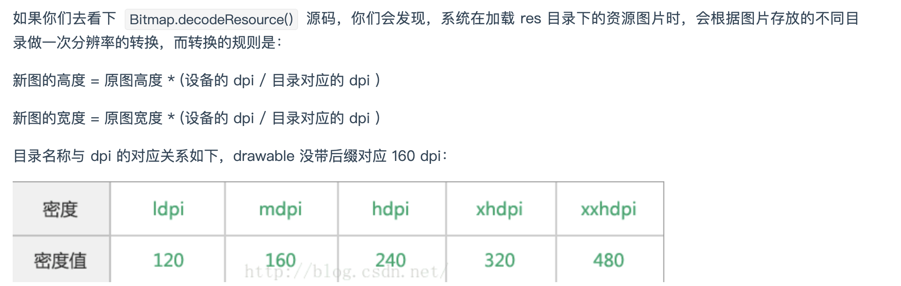

# 图片内存优化

## 图片问题

###问题一、内存中图片的宽高远大于控件宽高
**原因**

ImageLoader获取控件宽高时机太早，view都还没有draw完，所以拿不到具体宽高，就以屏幕宽高代替，导致对bitmap采样无效果。

对比Glide，Glide会监听view的ViewTreeObserver，在绘制第一帧前的回调里拿到view宽高。

场景：比如财富资讯里的图片。

###问题二：大部分的图片的像素格式用的是RGB565，但在内存中依然是一个像素占4个字节。
**原因**

对于有透明通道的图片，用RGB565解码，在内存中依然是一个像素占4个字节。而对于没有透明通道的图片，用RGB565解码，在内存中一个像素占2个字节。App内存中的大部分图片，虽然有透明通道，但并未使用，可转化为没有透明通道的图片，可明显降低图片内存。

###问题三：资源图片存放的目录不对。
**原因**

比如：一张图片只放在mdpi目录，而当前的设备显示器为480dpi的超超高密屏，这时Android就会按照3倍大小缩放这张图片，将它加载入内存。

##使用问题-及时释放

列表页面内存问题

移出屏幕的view是否被复用

没有复用需要主动释放view中的图片，怎么释放？重新加载？

释放后的图片要进缓存，不然会有体验问题

统一图片加载控件和图片加载库

