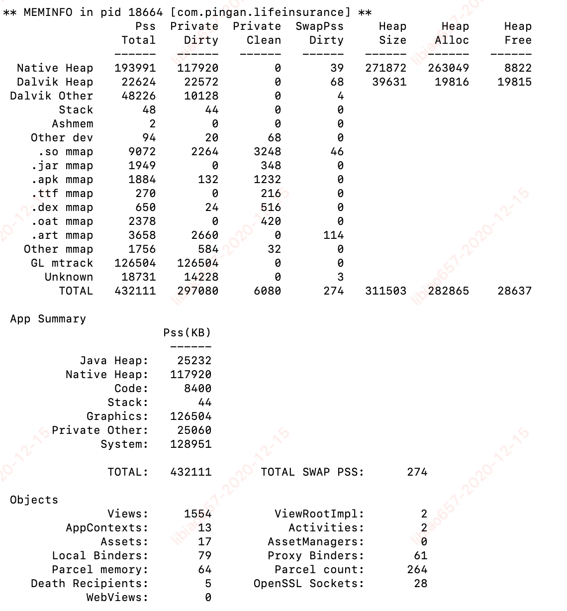

## 现状

### 内存问题：

1、OOM：在虚拟机的Heap内存使用超过堆内存最大值，堆内存最大值：runtime.getruntime().maxmemory()获取，为获取更大的堆内存值，可以在manifest里面设置LargeHeap为true

2、APP消耗内存过大导致的另外一个结果：Low Memory Killer。当系统物理内存不足时，lmk开始杀进程，从后台、桌面、服务、前台，直到手机重启。

3、GC导致App卡顿：Java内存不足会导致频繁GC，这个问题在Dalvik虚拟机会更加明显。而ART虚拟机在内存管理跟回收策略上都做了大量优化，内存分配和GC效率相比提升了5~10倍，但是还是有一种糟糕的情况 GC for Alloc，这个情况在内存不足以分配给新的对象时触发，造成阻塞GC。

### APP现状

1、平均内存

2、崩溃中“异常退出” 和OOM的比例，低端机占比

3、内存异常率：appPss > 400M

4、内存触顶率：appUsedHeap / appHeap > 85%

| 版本 | 平均内存（M） | OOM占比(%) | 内存异常率（%） | 内存触顶率（%）|
| ----- | ---- | ---- | ---- | ---- |
| 6.08.11 | 508.72 | 3 | 76.71 | 76.71 |

## 目标

1、数据指标

|平均内存（M） | OOM比例（%） | 内存异常率（%） | 内存触顶率（%）|
| ---- | ---- | ---- | ---- |
| < 350 | < 1 | < 10 | < 10 |

2、建立一套从架构-监控-分析的闭环体系

3、技术理论和实战经验的分享

## 计划

### 优秀的架构

1、设备分级

2、缓存管理

3、进程模型

4、图片策略

### 持续的监控

1、内存基本信息采集-papm

2、Java内存泄漏监控-建立类似LeakCanary自动化检测方案，修复系统泄漏，回收资源，白名单配置

3、OOM监控-字节开源的内存快照裁剪压缩工具Tailor，发生OOM的时候生成Hprof内存快照，上传后台分析

4、Native内存泄漏监控

5、图片监控-检测在view上decode超过该view尺寸的图片；图片尺寸是否超过手机屏幕大小

6、GC监控

21783-21806/debug I/insurance.debu: Background young concurrent copying GC freed 320012(14MB) AllocSpace objects, 64(2568KB) LOS objects, 43% free, 22MB/39MB, paused 273us total 116.598ms

### 完善的分析工具

#### 1、meminfo：

命令：adb shell dumpsys meminfo 进程名/ID

Context数量 = Activity数量 + Service数量 + 1

#### 2、AllocationTracker

会展示最近的500条内存分配，以及分配发生时刻的线程堆栈信息。

缺点：获取的信息过于分散；无法做到自动化分析，每次都需要开发者手工开始/结束；性能问题

自研：自定义的“Allocation Tracker”，实现对象内存的自动化分析。通过这个工具可以获取所有对象的申请信息(大小、类型、堆栈等)，可以找到一段时间内哪些对象占用了大量的内存。

#### 3、MAT：Hprof file（内存快照）分析工具

功能强大，但使用门槛颇高，不易上手；有些信息不够详细

自研Hprof分析工具：

1、所有activity对象，所有Bitmap对象，所有单例对象

2、以class中对象数量或大小为维度获取class的排序列表

3、对比两个Hprof文件内容的差别，多个dump中持续增长的对象

4、byte[]类型重复对象

5、重复图片，大图片，可以裁剪的图片 - 面板工具

#### 4、LeakCanary：

支持activity/fragment泄漏检测，但不够灵活，性能问题

自研工具：

1、支持activity/fragment以及其它自定义类的泄漏检测，支持Bitmap检测；

2、自动修复系统泄漏，回收资源；

3、灵活的白名单配置

#### 5、Memory Profiler

内存性能分析器是 Android Profiler 中的一个组件，可帮助您识别可能会导致应用卡顿、冻结甚至崩溃的内存泄露和内存抖动。它显示一个应用内存使用量的实时图表，让您可以捕获堆转储、强制执行垃圾回收以及跟踪内存分配。

## 补充

#### 管理好内存

1、减少内存的申请回收：

2、减少常驻内存：

图片内存

3、避免内存泄漏：

activity内存泄漏：GC ROOT对activity的直接引用、this$0间接引用、mContext的间接引用

#### 基础概念

* VSS：虚集合大小，包括文件或硬盘内存（file的map内存），与进程使用内存并没有多少关系

* RSS：常驻集合大小，计算全部共享内存（MMAP打开文件使用的内存，共享so库初始化所用的内存）

* PSS：比例集合大小，平分共享内存

* USS：独占集合大小，不计算共享内存

