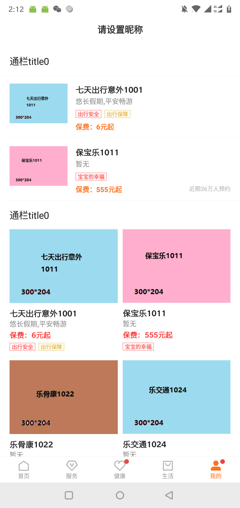
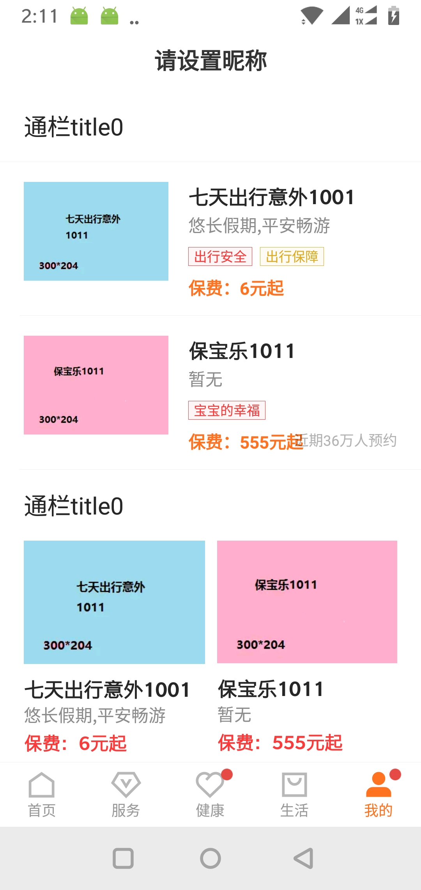
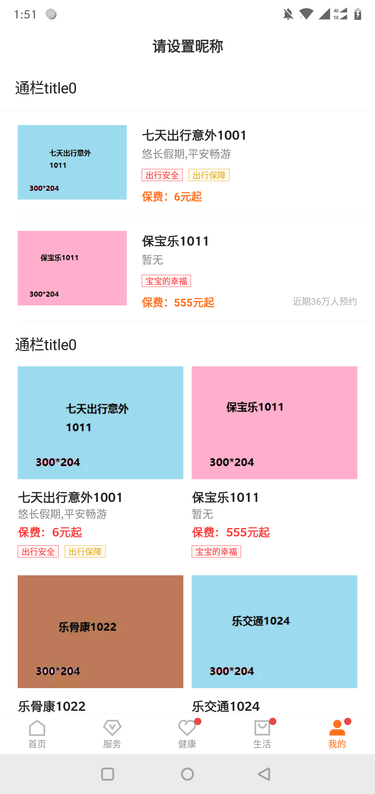
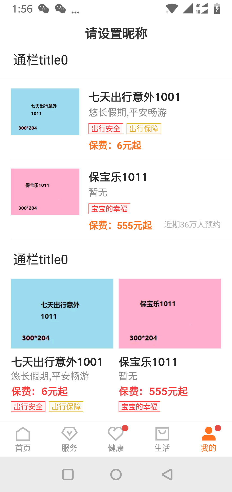
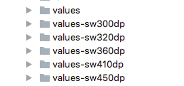
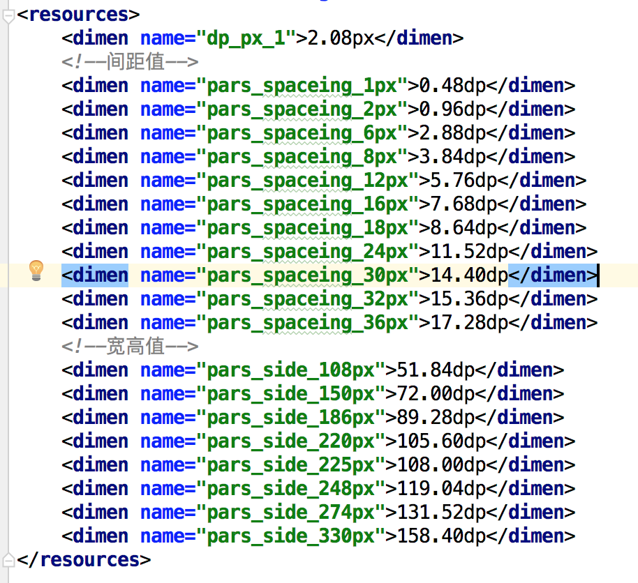
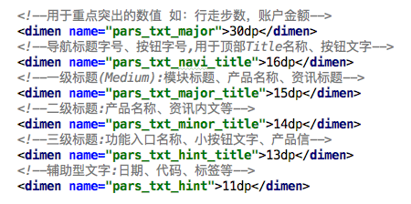
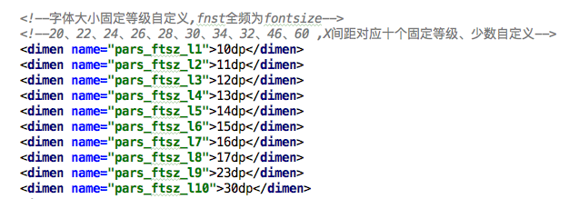

#App屏幕适配方案
##背景
1、同样宽是1080px的手机，因为手机屏幕密度（density）不一样，导致手机dp宽不一样，而我们是用一套dp值，在不同屏幕密度的手机上，UI显示就会不一致。特别是按屏幕宽分配大小的图片和固定值大小的图片对比会很明显（如下图，为同一手机调整屏幕密度后显示的UI）。
>px = dp * density

2、dimens文件使用混乱，不便管理。

<table width=70%>
    <tr style="background-color:gray">
        <td >
 图1  450dp宽 未适配
</td>
        <td >
 图2  320dp宽 未适配
</td>
    </tr>
    <tr style="background-color:gray">
        <td >
 图3  450dp宽 适配后
</td>
        <td >
 图4  320dp宽 适配后
</td>
    </tr>
</table>

##方案：smallestWidth适配
smallestWidth适配，或者叫sw限定符适配。指的是Android会识别屏幕的dp宽，然后根据识别到的结果去资源文件中寻找对应限定符的文件夹下的资源文件。

举个例子，荣耀10的屏幕密度（density）是3,横向像素是1080px，根据px=dp * density，横向的dp值是1080/(3),也就是360dp,系统就会去寻找是否存在value-sw360dp的文件夹以及对应的资源文件。

smallestWidth限定符适配有很好的容错机制，如果没有value-sw360dp文件夹，系统会向下寻找，比如离360dp最近的只有value-sw320dp，那么Android就会选择value-sw320dp文件夹下面的资源文件。

##怎么编写dimens文件
以设计图稿宽750px为准，在values-sw360dp文件夹下，手机的最小宽度的dp值是360，我们把360dp等分成750等份，每一个设计稿中的像素，大概代表smallestWidth值为360dp的手机中的0.48dp。定义这几个300，320，360，410，450屏幕dp宽的dimens文件就基本能涵盖市面上大部分手机了。

##每个dimens文件应该设计哪些尺寸值
对标设计稿的px值，目前只有两种类型，一是间距，二是宽高。如下图sw360dp文件夹下的dimens文件，值不会很多，通用尺寸，和设计达成一致，基本所有场景都可以沿用。尽量不添加新的尺寸，有特殊要添加的，每个文件添加一份，按比例计算好值。

##注意事项
 >1、字体大小不做屏幕适配，统一沿用values下dimens文件定义好的值，**注意字体大小单位统一用dp，而不是sp。**
 
 <table width=80%>
    <tr>
        <td >

</td>
        <td >

</td>
    </tr>
</table>
 
 >2、**请遵守这套规范。**

* 本文档更新时间：2018-09-10